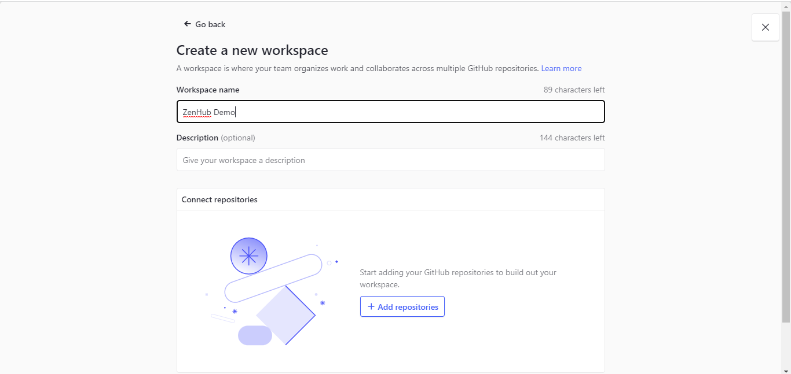
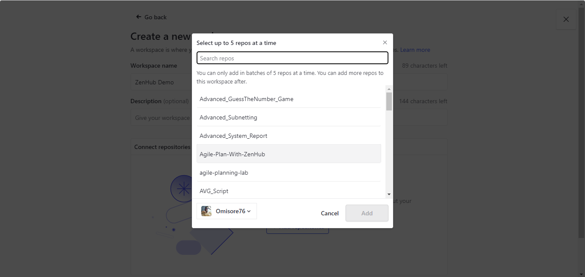
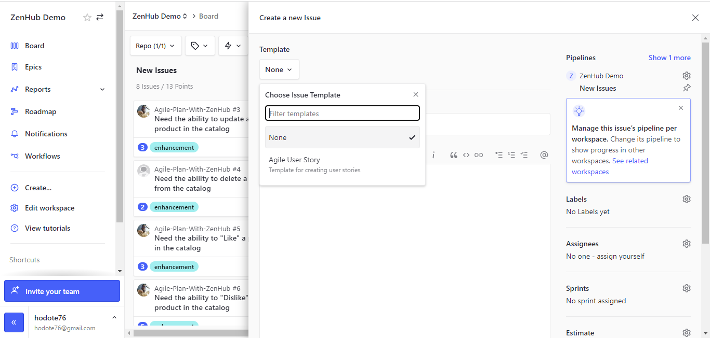
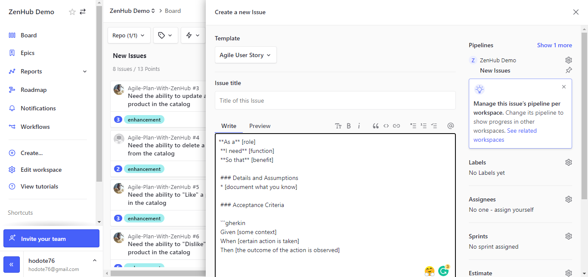

# Agile-Plan-With-ZenHub

## Project Description

User stories are written by developers to capture a user's specific needs. They can be used to indicate who a user is, what they need to do, and why they need to do it. A user story should be concise, yet descriptive enough to give the development team a good understanding of the user's needs.

The issue template that is contained in this repository can be used to help create user stories that are well-formed and easy to understand on ZenHub. This template can be used as is, or it can be modified to suit the needs of your specific project. Either way, using this template will help ensure that your user stories are clear, concise, and easy to work with.

### ZenHub

ZenHub is a project management tool that helps you plan and execute agile development projects. It's simple to use, and getting started is quick and easy. 

ZenHub is a tool that can help developers manage their projects and workflows more effectively. It provides a variety of features that can make development workflows more efficient, such as issue tracking, Kanban boards, and tools for managing release cycles. In addition, ZenHub can help developers to collaborate more effectively by providing tools for communication and code review.

It also has the ability to connect to GitHub

## Project Scenario

Your team (New Age Team) is responsible for developing the backend product catalog for an e-commerce website. The stakeholders require the ability to create, retrieve, update, and delete products from the catalog. They have also asked for customers to be able to "like" a product and have the site show the like count on the product page. In addition to the catalog functionality, they have requested that it should be hosted in a cloud environment with automated deployments. 

## Project Solution

The solution to the project scenario can be found in this well-detailed step-by-step article on how to utilize ZenHub for your agile planning https://learntodevops.hashnode.dev/complete-agile-planning-with-zenhub. 

The article begins by outlining the basics of what ZenHub is and how it can be used to help boost your productivity. It then goes on to provide a step-by-step guide on how to set up and use ZenHub for your agile planning. Finally, the article gives some tips on how to get the most out of ZenHub and how to make it work for you.

## Prerequisite

There are few things you need to setup to utilize this repo:

- ZenHub account. Learn how to create one [Here](https://www.zenhub.com/getting-started) 
- ZenHub account linked with your GitHub account. Learn how to link ZenHub with a GitHub account [Here](https://help.zenhub.com/support/solutions/articles/43000650569-connecting-your-github-account-to-zenhub)

## How To Use The Repo

1)	Fork the repo

2)	Create a new workspace on ZenHub

3)	Click “add repositories”, and select this repo

4)	Once the workspace is ready, click “new issues” 

5)	Click template and select “Agile User Story” 

6)	Then fill out the user story template

Of course, you can customize the template to suit your needs.

